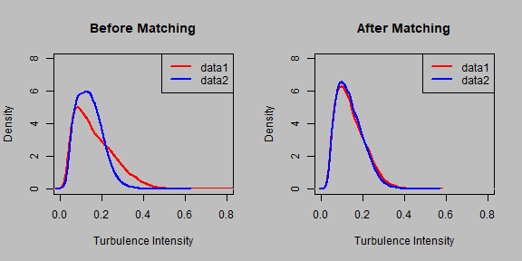
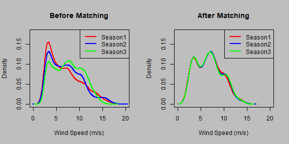

# Introduction

The package aims at unveiling a technique called covariate matching, which takes in different data sets and returns data sets whose feature values exhibit similar characteristics or similar distribution. In other words, if a wind speed of 3.2 m/s exists in one data set, the algorithm tries to find wind speed in the vicinity of 3.2 m/s in the other data set.


#  Theory
Covariate matching methods are rooted in the statistical literature. In
stabilizing the non-experimental discrepancy between non-treated and treated subjects of observational data, covariate distributions are adjusted by selecting non-treated subjects that have a similar covariate condition as that of treated ones. Through the process of matching, non-treated and treated groups become only randomly different on all background covariates, as if these covariates were designed by experimenters. As a result, the outcomes of the matched non-treated and treated groups, which keep the originally observed values, are comparable under the matched covariate conditions.

### 1. Definition
Covariate matching is a technique to adjust covariates distribution to make treated and non treated group to have the same covariates condition.

### 2. Algorithm
Covariate matching is broadly divided into steps : Hierarchial subgrouping and one to one matching.

### Hierarchial subrouping - Filters data record in non-treated group which satifies the threshold condition for each data record in treated group.

1. Locate a data record in the treated group, Q<sub>aft</sub>, and label it by the index j.

2. Select one of the covariates, for instance, wind speed, V , and designate it as the variable of which the similarity between two data records is computed.

3. Go through the data records in the non-treated group, Q<sub>bef</sub>, by selecting the subset of data records such that the difference, in terms of the designated covariate, between the data record j in Q<sub>aft</sub> and any one of the records in Q<sub>bef</sub> is smaller than a pre-specified threshold. When V is in fact the one designated in Step 2, the resulting subset is then labeled by placing V as the subscript to Q, namely Q<sub>V</sub>.

4. Next, designate another covariate and use it to prune Q<sub>V</sub> in the same way as one prunes Q<sub>bef</sub> into Q<sub>V</sub> in Step 3. Doing so produces a smaller subset nested within Q<sub>V</sub> . Then continue with another covariate until all covariates are used.

### One to One matching - returns the most similar data record after hierarchial sub-grouping

1. Select the most similar record from Q<sub>bef</sub> for each Q<sub>aft</sub> using mahalanobis distance as the similarity measure.

2. Remove the record from Q<sub>aft</sub>, if a record in Q<sub>bef</sub> satisfies the above mentioned criteria. 

3. Repeat the process for each record in Q<sub>aft</sub>

# Getting Started with WindPlus

Load the library


```r
library(WindPlus)
```

## Functions available

1. Matching two data sets

Function : covmatch.binary(dname, cov, weight, cov_circ)

* dname - List of data sets to match
* cov - vector defining position or column number of non circular covariates such as wind speed, temperature etc.
* weight - vector defining the threshold value for each covariate to skim out most similar observation
* cov_circ - vector defining position or column number of circular covariates such as wind direction, nacelle position etc.

2. Matching multiple data sets

Function : covmatch.mult(dname, cov, weight, cov_circ)

* dname - List of data sets to match
* cov - vector defining position or column number of non circular covariates such as wind speed, temperature etc.
* weight - vector defining the threshold value for each covariate to skim out most similar observation
* cov_circ - vector defining position or column number of circular covariates such as wind direction, nacelle position etc.

## Functions distinction

Even though, the arguments seem pretty similar for both the functions, there is a subtle difference in execution. For matching multiple data sets, data set is matched once, whereas for macthing two data sets, the matching is done twice keeping each of the data set as a reference. Since the method is entirely subjective, an exact explanation of such is not possible.

## Data set available

1. Matching two data sets

The two data sets attached to make use of function covmatch.binary for users are data1 and data2. The data can be made available after installing the package and loading the library. The data sets correspond to wind energy data set, and both of these are two different turbines data aggregated by 10 minutes over a year.


```r
head(data1)
#>   wind_speed nac_position wind_direction generator_speed active_power
#> 1   7.945652    -139.6754       4.107717        15.78978     812.1883
#> 2   7.812174    -139.4615       1.811087        15.37674     753.0530
#> 3   7.270667    -139.2280       6.995000        14.01167     575.1650
#> 4   6.535495    -145.5636       4.193736        12.75363     431.0602
#> 5   7.057674    -149.5409      -4.656279        13.87977     548.4242
#> 6   6.357174    -150.0903      -5.499022        12.81163     434.1179
#>   ambient_temp   angle_1   angle_2   angle_3 power_limitation state stdeviation
#> 1     7.423696 -1.110000 -1.160000 -1.170000                0     1    2.781440
#> 2     7.229783 -1.110000 -1.160000 -1.170000                0     1    4.896038
#> 3     7.301000 -1.177333 -1.117333 -1.113667                0     1    6.202045
#> 4     7.345495 -1.290000 -1.230000 -1.280000                0     1    6.409968
#> 5     7.142326 -1.172326 -1.128837 -1.130698                0     1    4.276982
#> 6     6.992717 -1.000000 -1.020000 -1.050000                0     1    4.254190
#>   turbulence_intensity angle_avg
#> 1           0.13551092 -1.146667
#> 2           0.14273562 -1.146667
#> 3           0.09662243 -1.136111
#> 4           0.12099316 -1.266667
#> 5           0.12291786 -1.143953
#> 6           0.09653338 -1.023333
```


```r
head(data2)
#>   wind_speed nac_position wind_direction generator_speed active_power
#> 1   6.739239     443.0380       3.942935        13.34217     512.9733
#> 2   6.307717     443.1316       3.603696        12.77554     447.0826
#> 3   6.017283     442.9578       2.200652        12.14239     384.0130
#> 4   6.331522     442.9311       4.859348        12.59370     419.8793
#> 5   6.685978     443.0648       6.777717        13.14359     477.1336
#> 6   5.390833     443.2475       4.926250        10.87000     248.5533
#>   ambient_temp angle_1 angle_2 angle_3 power_limitation state stdeviation
#> 1     4.484565   -1.21   -1.21   -1.23                0     1    3.098794
#> 2     4.519239   -1.21   -1.21   -1.23                0     1    3.065769
#> 3     4.442717   -1.21   -1.21   -1.23                0     1    3.355477
#> 4     4.539239   -1.21   -1.21   -1.23                0     1    2.965232
#> 5     4.464783   -1.21   -1.21   -1.23                0     1    1.751849
#> 6     4.305417   -1.21   -1.21   -1.23                0     1    3.133455
#>   turbulence_intensity angle_avg
#> 1            0.1414439 -1.216667
#> 2            0.1363695 -1.216667
#> 3            0.1274254 -1.216667
#> 4            0.1080415 -1.216667
#> 5            0.1498261 -1.216667
#> 6            0.1105451 -1.216667
```

1. Matching multiple data sets

The three data sets attached to make use of function covmatch.mult for users are Season1, Season2 and Season3. The data sets correspond to wind energy data set of a single turbine, splitted in 3 seasons over a year.


```r
head(Season1)
#>   wind_speed nac_position wind_direction generator_speed active_power
#> 1   9.519457     570.3934     -6.6969565        17.29500    1417.1964
#> 2   9.145057     570.4648     -5.1733333        17.29851    1328.8118
#> 3   8.190000     576.5300     -0.3680000        16.93800    1041.9080
#> 4   6.538939     574.5732     -2.7621212        13.74227     529.6517
#> 5   6.781196     574.7518      0.3546739        14.12543     571.1225
#> 6   6.772717     574.7117      5.2710870        14.23826     585.9740
#>   ambient_temp    angle_1    angle_2    angle_3 power_limitation state month
#> 1     5.848587 -0.5384783 -0.5640217 -0.5389130                0     1     1
#> 2     5.843448 -0.9454023 -0.9573563 -0.9162069                0     1     1
#> 3     5.980000 -1.2000000 -1.1900000 -1.2300000                0     1     1
#> 4     5.875909 -1.0400000 -1.0300000 -1.0300000                0     1     1
#> 5     5.973587 -1.0400000 -1.0300000 -1.0300000                0     1     1
#> 6     6.021957 -1.0400000 -1.0300000 -1.0300000                0     1     1
#>   stdeviation turbulence_intensity
#> 1   0.6142741           0.08949789
#> 2   0.5847955           0.08520295
#> 3   0.7913912           0.11530332
#> 4   0.5145069           0.07496211
#> 5   0.4473754           0.06518124
#> 6   0.4189708           0.06104278
```


```r
head(Season2)
#>   wind_speed nac_position wind_direction generator_speed active_power
#> 1   13.36543     194.2200       4.620543        17.30011     1528.446
#> 2   13.52815     194.2200       6.779891        17.31304     1531.465
#> 3   14.18163     194.2334       7.360000        17.29272     1532.282
#> 4   14.02707     191.2653       5.816848        17.29196     1532.273
#> 5   14.12576     189.2733       5.997609        17.30565     1527.963
#> 6   13.94370     189.3000       5.677717        17.29163     1529.607
#>   ambient_temp  angle_1  angle_2  angle_3 power_limitation state month
#> 1     19.02500 11.48696 11.44989 11.51217                0     1     4
#> 2     19.01500 11.56185 11.51609 11.59804                0     1     4
#> 3     18.99489 12.63000 12.58522 12.64446                0     1     4
#> 4     18.92728 12.25467 12.22141 12.26870                0     1     4
#> 5     18.95804 12.46446 12.42130 12.48467                0     1     4
#> 6     18.88870 11.99717 11.94130 12.00946                0     1     4
#>   stdeviation turbulence_intensity
#> 1   1.0590929            0.1485948
#> 2   0.9685266            0.1358880
#> 3   0.8514284            0.1194587
#> 4   0.9916969            0.1391389
#> 5   1.2501088            0.1753950
#> 6   1.2154335            0.1705300
```


```r
head(Season3)
#>   wind_speed nac_position wind_direction generator_speed active_power
#> 1   3.720000    -164.7345      1.3381176        9.990118    97.098706
#> 2   2.830698    -176.9842      6.6573256        9.999186    59.256628
#> 3   3.276941    -188.2048      5.7588235        9.993765    74.341647
#> 4   2.420370    -198.6938     -0.2095062        9.828519    15.090370
#> 5   2.437273    -191.7600     14.3063636        9.279091     5.102727
#> 6   2.885094    -198.8130     -3.4054717        9.997736    23.681509
#>   ambient_temp angle_1 angle_2 angle_3 power_limitation state month stdeviation
#> 1     26.26835   -0.01   -0.10   -0.05                0     1     7   0.5207275
#> 2     26.39500   -0.01   -0.10   -0.05                0     1     7   0.4862335
#> 3     25.95929   -0.01   -0.10   -0.05                0     1     7   0.3052790
#> 4     26.10630   -0.01   -0.10   -0.05                0     1     7   0.4919945
#> 5     26.10909   -0.01   -0.10   -0.05                0     1     7   0.2037200
#> 6     25.79679   -0.10   -0.02   -0.14                0     1     7   0.2265937
#>   turbulence_intensity
#> 1           0.06892192
#> 2           0.06435640
#> 3           0.04040581
#> 4           0.06511891
#> 5           0.02696376
#> 6           0.02999126
```
## Usage

1. Matching two data sets


```r
# Prepare data set for matching
dname = rep(list(), 2)
dname[[1]] = data1
dname[[2]] = data2


# Non circular covariates column
cov = c(6, 1, 13)

# Weight 
weight = c(0.1, 0.1, 0.05)

# Matching
matched = covmatch.binary(dname = dname, weight = weight, cov = cov, cov_circ = NULL)

# Commpare result of one covariate with original data
par(mfrow =  c(1, 2))
par(bg = 'grey')

plot(density(dname[[1]][, 13]), col = 'red', main = 'Before Matching', xlab = 'Turbulence Intensity', lwd = 2, xlim = c(0, 0.8), ylim = c(0, 8))
lines(density(dname[[2]][, 13]), col = 'blue', lwd = 2, ylim = c(0, 8), xlim = c(0, 0.8), ylim = c(0, 8))
legend('topright', legend = c('data1', 'data2'), col=c("red", "blue"), lty=1, lwd = 2)

plot(density(matched[[1]][, 13]), col = 'red', main = 'After Matching', xlab = 'Turbulence Intensity', lwd = 2, xlim = c(0, 0.8), ylim = c(0, 8))
lines(density(matched[[2]][,13]), col = 'blue', lwd = 2, xlim = c(0, 0.8), ylim = c(0, 8))
legend('topright', legend = c('data1', 'data2'), col=c("red", "blue"), lty=1, lwd = 2)
```




2. Matching multiple data sets


```r
# Prepare data set for matching
dname = rep(list(), 3)
dname[[1]] = Season1
dname[[2]] = Season2
dname[[3]] = Season3

# Non circular covariates column
cov = c(1, 6, 14)

# Weight 
weight = c(0.2, 0.2, 0.2)

# Matching
matched = covmatch.mult(dname = dname, weight = weight, cov = cov, cov_circ = NULL)

# Commpare result of one covariate with original data
par(mfrow =  c(1, 2))
par(bg = 'grey')

plot(density(dname[[1]][, 1]), col = 'red', main = 'Before Matching', xlab = 'Wind Speed (m/s)', lwd = 2, xlim = c(0, 20), ylim = c(0, 0.18))
lines(density(dname[[2]][, 1]), col = 'blue', lwd = 2, xlim = c(0, 20), ylim = c(0, 0.18))
lines(density(dname[[3]][, 1]), col = 'green', lwd = 2, xlim = c(0, 20), ylim = c(0, 0.18))
legend('topright',legend = c('Season1', 'Season2', 'Season3'), col=c("red", "blue", "green"), lty=1, lwd = 2)

plot(density(matched[[1]][, 1]), col = 'red', main = 'After Matching', xlab = 'Wind Speed (m/s)', lwd = 2, xlim = c(0, 20), ylim = c(0, 0.18))
lines(density(matched[[2]][, 1]), col = 'blue', lwd = 2, xlim = c(0, 20), ylim = c(0, 0.18))
lines(density(matched[[3]][, 1]), col = 'green', lwd = 2, xlim = c(0, 20), ylim = c(0, 0.18))
legend('topright',legend = c('Season1', 'Season2', 'Season3'), col=c("red", "blue", "green"), lty=1, lwd = 2)
```



## Result

The task at hand is to find the observations from two or more different set, which exhibit similar characteristics. The functions return a list containing the data sets only with matched observations. It should be kept in mind that, only the supplied covariates are matched. Even though data set containing all the columns are returned back, the columns of interest should be looked into. 
